# GRID CRM Figma UI — 4-Phase Implementation Plan

## Source of truth

All screens live in the local reference app: [`Design System for GRID CRM/`](Design System for GRID CRM/)

- **67 implementable screen variants** (excluding the 3 role-specific dashboard previews: Designer / Coordinator / Content)
- **Design tokens** already partially mirrored in [`app/globals.css`](app/globals.css) (`--figma-*`, `--neu-*`) and [`lib/projects/design-tokens.ts`](lib/projects/design-tokens.ts)
- **Reference pattern**: inline-style Vite components → port to Next.js using Tailwind + CSS vars + existing hub primitives (`MaterialIcon`, `NeuTabToggle`, `gi-gradient-cta`)

## Constraint

**Do not change dashboard pages** — keep [`components/dashboard/*-dashboard.tsx`](components/dashboard/) and their routes (`/dashboard/admin`, `/dashboard/lead`, etc.) as-is.

---

## 4-phase screen map

```mermaid
flowchart LR
  subgraph p1 [Phase 1]
    Shell[Shell and Nav]
    Clients[Clients x5]
    Suppliers[Suppliers x5]
    Notifs[Notifications]
  end
  subgraph p2 [Phase 2]
    Projects[Projects x5]
    Consult[Consultation x7]
  end
  subgraph p3 [Phase 3]
    Concept[Concept x7]
    Layout[Layout x2]
    ThreeD[3D x2]
    Detail[Detail Drawings x3]
  end
  subgraph p4 [Phase 4]
    Tasks[Tasks x3]
    Docs[Documents x7]
    Timeline[Timeline x4]
    Admin[Admin x4]
    Portal[Client Portal x4]
  end
  p1 --> p2 --> p3 --> p4
```

| Phase | Modules | Screens | Notes |
|-------|---------|---------|-------|
| **1** | Shell, Clients, Suppliers, Notifications | ~12 | **Implement now** |
| **2** | Projects hub, Consultation workspace | 12 | Align existing hub pages to Figma exactly |
| **3** | Concept, Layout, 3D, Detail Drawings | 14 | Phase workspaces under `/projects/[id]/...` |
| **4** | Tasks, Documents, Timeline, Admin, Client Portal | 22 | Includes standalone portal routes |

---

## Phase 1 — Detailed scope (implement now)

### 1. Restructure navigation to match Figma

Update [`components/layout/app-sidebar.tsx`](components/layout/app-sidebar.tsx) and [`types/navigation.ts`](types/navigation.ts) to the **8 top-level Figma items**:

| Figma nav | Route | Phase 1 action |
|-----------|-------|----------------|
| Dashboard | Role home (`/dashboard/*`) | Keep unchanged |
| Clients | `/clients` | Rebuild UI |
| Suppliers & Sub-Vendors | `/suppliers` | **New** |
| Project Hub | `/projects` | Keep route; sidebar link only (UI in Phase 2) |
| Tasks | `/my-tasks` | Keep route; sidebar link only (UI in Phase 4) |
| Documents & Minutes | `/files` | Keep route; sidebar link only (UI in Phase 4) |
| Timeline & Reports | `/projects/[id]/timeline` | Sidebar resolves via last project (UI in Phase 4) |
| Admin Panel | `/user-management` | Keep route; sidebar link only (UI in Phase 4) |

**Remove from sidebar** (not in Figma): granular Project Hub / Work Board / Project Files / Minutes links, Team, Hold Requests, Access Requests, Guest Users. These pages stay reachable via direct URL and command palette until Phase 4 folds them into Admin/Documents.

Update [`lib/navigation/sidebar-role.ts`](lib/navigation/sidebar-role.ts) and route guards in [`types/navigation.ts`](types/navigation.ts) for the new `/suppliers` route.

### 2. Top bar alignment

Enhance [`components/layout/app-header.tsx`](components/layout/app-header.tsx) to match [`Design System for GRID CRM/src/components/TopBar.tsx`](Design System for GRID CRM/src/components/TopBar.tsx):

- Breadcrumb trail (`GRID CRM › Section › Page`)
- Global search with teal focus glow
- Notification bell dropdown (mock unread count, mark-all-read)
- Page title from route context map

Wire breadcrumbs via a small helper in `lib/navigation/page-meta.ts`.

### 3. Clients module (5 screens)

Port from [`Design System for GRID CRM/src/screens/clients/`](Design System for GRID CRM/src/screens/clients/):

| Screen | Route | Component |
|--------|-------|-----------|
| Client List | `/clients` | `components/clients/client-list-screen.tsx` |
| Client Profile | `/clients/[clientId]` | `components/clients/client-profile-screen.tsx` |
| Comm Log | `/clients/[clientId]/comm-log` | `components/clients/comm-log-screen.tsx` |
| Lead Pipeline | `/lead-pipeline` | `components/clients/lead-pipeline-screen.tsx` |
| Follow-up Panel | Overlay on client list | `components/clients/follow-up-panel.tsx` |

**Replace** the current simplified [`components/clients/clients-page.tsx`](components/clients/clients-page.tsx) and decouple lead pipeline from the clients tab (currently embedded).

**Mock data**: Replace [`lib/clients/mock-clients.ts`](lib/clients/mock-clients.ts) with the richer schema from [`Design System for GRID CRM/src/data/clients.ts`](Design System for GRID CRM/src/data/clients.ts) (statuses Active/Lead/Past, lead stages, follow-up dates, comm log entries). Add `types/clients.ts` fields to match.

Shared client micro-components (status badge, avatar, project count badge) go in `components/clients/client-ui.tsx`.

### 4. Suppliers module (5 screens) — new

Port from [`Design System for GRID CRM/src/screens/suppliers/`](Design System for GRID CRM/src/screens/suppliers/):

| Screen | Route | Component |
|--------|-------|-----------|
| Supplier / Sub-vendor List (tabs) | `/suppliers` | `components/suppliers/supplier-list-screen.tsx` |
| Supplier Profile | `/suppliers/[supplierId]` | `components/suppliers/supplier-profile-screen.tsx` |
| Sub-vendor Profile | `/suppliers/sub-vendors/[vendorId]` | `components/suppliers/sub-vendor-profile-screen.tsx` |
| Add Supplier Modal | Modal on list page | `components/suppliers/add-supplier-modal.tsx` |

**New files**:
- `app/(dashboard)/suppliers/page.tsx`
- `app/(dashboard)/suppliers/[supplierId]/page.tsx`
- `app/(dashboard)/suppliers/sub-vendors/[vendorId]/page.tsx`
- `lib/suppliers/mock-suppliers.ts` (from [`Design System for GRID CRM/src/data/suppliers.ts`](Design System for GRID CRM/src/data/suppliers.ts))
- `types/suppliers.ts`

### 5. Notifications screen (1 screen)

Redesign [`app/(dashboard)/notifications/page.tsx`](app/(dashboard)/notifications/page.tsx) using [`Design System for GRID CRM/src/screens/notifications/NotificationsScreen.tsx`](Design System for GRID CRM/src/screens/notifications/NotificationsScreen.tsx):

- Filter tabs: All / Tasks / Files / Deadlines / Mentions
- Grouped list: Today / Yesterday / This Week
- Mock data in `lib/notifications/mock-notifications.ts`
- Keep existing API hook as optional fallback behind a feature flag or use mock-only for Phase 1

### 6. Shared porting conventions

For every Phase 1 screen:

1. Convert inline `style={{}}` from reference → Tailwind classes using `--figma-*` / `--neu-*` CSS vars
2. Replace `className="material-icons-outlined"` → existing [`MaterialIcon`](components/projects/hub/material-icon.tsx)
3. Use `"use client"` + local React state for interactions (filters, tabs, modals)
4. Add [`DemoCaption`](components/demo/demo-caption.tsx) banner on mock-data pages
5. Preserve neumorphic card shadows via existing utility classes in [`app/globals.css`](app/globals.css)

---

## Phase 1 file summary

**New routes (4)**:
- `app/(dashboard)/clients/[clientId]/page.tsx`
- `app/(dashboard)/clients/[clientId]/comm-log/page.tsx`
- `app/(dashboard)/suppliers/page.tsx`
- `app/(dashboard)/suppliers/[supplierId]/page.tsx`
- `app/(dashboard)/suppliers/sub-vendors/[vendorId]/page.tsx`

**Modified (6)**:
- [`components/layout/app-sidebar.tsx`](components/layout/app-sidebar.tsx)
- [`components/layout/app-header.tsx`](components/layout/app-header.tsx)
- [`types/navigation.ts`](types/navigation.ts)
- [`lib/navigation/sidebar-role.ts`](lib/navigation/sidebar-role.ts)
- [`app/(dashboard)/clients/page.tsx`](app/(dashboard)/clients/page.tsx)
- [`app/(dashboard)/lead-pipeline/page.tsx`](app/(dashboard)/lead-pipeline/page.tsx)
- [`app/(dashboard)/notifications/page.tsx`](app/(dashboard)/notifications/page.tsx)

**New component folders**: `components/clients/*` (rebuilt), `components/suppliers/*`

---

## Future phases (not in Phase 1)

### Phase 2 — Projects + Consultation (12 screens)
- Align [`projects-list-page.tsx`](components/projects/hub/projects-list-page.tsx), [`new-project-modal.tsx`](components/projects/hub/new-project-modal.tsx), [`historical-project-detail.tsx`](components/projects/hub/historical-project-detail.tsx), [`project-overview-screen.tsx`](components/projects/hub/project-overview-screen.tsx) to Figma reference
- Add consultation workspace at `/projects/[projectId]/consultation` with 7 sub-views

### Phase 3 — Phase workspaces (14 screens)
- Concept Design (7), Layout (2), 3D (2), Detail Drawings (3) under project routes

### Phase 4 — Operations + external (22 screens)
- Tasks workspace, Documents workspace, Timeline workspace, Admin workspace (users/assignments/settings), Client Portal (standalone `/portal/*` routes)
- Re-home Team, Hold Requests, Access Requests, Guest Users under Admin Panel nav

---

## Verification checklist (Phase 1)

- Sidebar shows exactly 8 Figma nav items; dashboard links unchanged
- `/clients` matches Figma client list (table + grid toggle, filters, add client)
- Clicking a client opens profile; comm log and follow-up panel work
- `/lead-pipeline` shows kanban columns matching Figma
- `/suppliers` shows supplier/sub-vendor tabs; profiles and add modal work
- `/notifications` matches Figma grouped notification UI
- All Phase 1 pages use design-system mock data and show demo caption
- No changes to `/dashboard/*` pages
