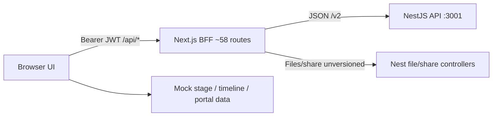

# GRID Frontend — Integration Analysis & Delivery Timeline

**Document type:** Tech-lead assessment + delivery plan  
**Frontend repo:** `grid-interior-frontend`  
**Requirements source:** [GRID_Interior_Project_Requirements_v1.2.md](./GRID_Interior_Project_Requirements_v1.2.md)  
**Assessment date:** 1 Sep 2026  
**Target deadline:** Friday **19 Sep 2026** (end of September week 3)  
**Calendar window:** 1 Sep → 19 Sep ≈ **14 working days**

---

## 1. Executive verdict

The **frontend UI is complete** as a product surface. The Next.js app already includes a mature **BFF layer** (~58 `/api` routes) that proxies to NestJS (`BACKEND_API_URL`, typically `http://localhost:3001/v2`) when `NEXT_PUBLIC_ENABLE_AUTH=true`.

**Core platform spine is largely FE-wired** (~60–70% of Core MVP): auth, users, projects/members, tasks/holds, files/share/multipart, meeting minutes, clients/pipeline/comm-log, suppliers/sub-vendors/vendor-tasks, project links, dashboards, notifications, access requests, and settings.

**The largest remaining product surface is still mock-driven:** the six project-hub stage workspaces (Consultation → Execution), timeline/Gantt/reports, and the client portal. Those screens look production-ready in the UI but have no live domain APIs/mappers in this repo.

| Question | Answer |
|---|---|
| Can Core MVP ship by 19 Sep? | **Yes — tight but possible** if Nest already covers most BFF paths and 1–2 engineers work full-time on BE gaps + FE polish |
| Can all 6 stages + timeline + portal ship by 19 Sep? | **No** without pre-built Nest APIs and a larger parallel team — treat as Phase 2 |
| Full M1–M6 requirements fidelity? | **Slip into October** unless BE capacity is already ahead of the UI |

**Recommended ship scope for 19 Sep:** Core MVP against NestJS. Stage workspaces, timeline, and portal stay mock (or hidden behind a “coming soon” note) until Phase 2.

---

## 2. Architecture (current)

| Layer | Role |
|---|---|
| Browser | React Query hooks → same-origin `/api/*` via `authApiClient` |
| Next.js BFF | `app/api/**` proxies with `backendFetch` / `backendFileFetch` |
| NestJS | Source of truth; Supabase-backed auth expected |
| Auth gate | `NEXT_PUBLIC_ENABLE_AUTH !== "true"` → UI-only mode + `dev-bypass` session |

**Env (minimum for live mode):**

- `NEXT_PUBLIC_ENABLE_AUTH=true`
- `BACKEND_API_URL=http://localhost:3001/v2`
- `NEXT_PUBLIC_APP_URL` (share links)
- Google Maps key (maps config route)
- S3/CORS configured on Nest for multipart uploads

**Known config footgun:** JSON helpers default to port **3001**; some file/share helpers still fall back to **3000** if env is unset. Always set `BACKEND_API_URL` explicitly.

---

## 3. Domain maturity matrix

Legend: **Wired** = live via BFF/hooks when auth on · **Hybrid** = shell/list live, content partially mock · **Mock** = UI-only fixtures

### Core MVP (target for 19 Sep)

| Domain | Requirements | FE status | Integration effort left | Notes |
|---|---|---|---|---|
| Auth & sessions | Login, refresh, me, password, sessions | Wired | S | Logout BFF is stub (no Nest revoke) |
| Users / RBAC | 5 go-live roles | Wired | M | Validate Nest role names vs UI |
| Access requests | Review queue | Wired | S–M | |
| Projects list/create/overview | Project hub shell | Wired | M | Members + phase from project stage |
| Project members | Assignments | Wired | S | |
| Tasks / assignees / dates | M4 | Wired | M | Missing FE BFF: `POST /api/tasks/:id/reopen` |
| Hold requests | Global + project | Wired | M | |
| Project files / folders / multipart / share | M5 | Wired | M–L | Ops: S3 CORS + ETag |
| Meeting minutes (project) | M5 | Wired | M | Global `/files` minutes still hybrid |
| Clients / pipeline / comm-log | M1 | Wired (+ demo when auth off) | M | Attachments & follow-up assignees need polish |
| Suppliers / sub-vendors / vendor tasks | M2 | Wired | M | BOQ↔supplier deep link = Phase 2 |
| Project links | Client/supplier on project | Wired | S–M | |
| Role dashboards | Admin / SA / lead / member | Wired (aggregated) | S–M | |
| Notifications | Composed inbox | Wired | M | Read-state is localStorage |
| Settings / appearance | Profile, prefs, sessions | Wired | S | |
| Public file share landing | Token share | Wired | S | |
| Guest users admin page | Guests | **Mock / incomplete** | M | Hardcoded rows; mutations no-op |
| Team / admin assignments tab | Directory | Mock | M | Can defer or map from `/users` |

### Phase 2 (post week-3)

| Domain | Requirements | FE status | Effort | Notes |
|---|---|---|---|---|
| Consultation workspace | M3 Phase 1 | Mock | L | Rich multi-tab domain |
| Concept design | M3 Phase 2 | Mock | L | Areas, renders, revisions |
| Layout | M3 Phase 3 | Mock | L | |
| 3D design | M3 Phase 4 | Mock | L | |
| Detail drawings / BOQ director | M3 Phase 5 | Mock | L | |
| Execution / BOQ / site | M3 Phase 6 | Mock | L+ | Deepest commercial model |
| Timeline & reports | M6 | Hybrid / Mock content | L | Header may be live; Gantt is mock |
| Client portal | M6 | Mock | L | `/portal/[token]` |
| Historical projects depth | M3 | Demo-leaning | S–M | |

---

## 4. Gap register

### 4.1 Frontend must-fix (Core MVP)

| ID | Gap | Action |
|---|---|---|
| FE-1 | No `app/api/tasks/[taskId]/reopen/route.ts` while hooks call it | Add BFF proxy to Nest reopen endpoint (or remove UI call until BE exists) |
| FE-2 | `/api/auth/logout` returns success without Nest revoke | Proxy to Nest logout/session invalidate when available |
| FE-3 | File helpers default host `:3000` vs API `:3001` | Unify defaults on `BACKEND_API_URL` / `:3001` |
| FE-4 | Guest users page stubbed | Wire to `useUsers` + guest role **or** hide route until ready |
| FE-5 | Mapper drift risk (`pickString` / snake↔camel) | Smoke each domain with real Nest payloads; fix empty fields |
| FE-6 | Comm-log attachments / follow-up assignees still demo-ish | Finish against Nest upload + user list |
| FE-7 | Global `/files` hybrid (mock folder tree) | Accept scoped DoD: live recent files + project file boards; defer full global tree |
| FE-8 | Sparse `error.tsx` / no `loading.tsx` | Optional polish — not a ship blocker |

### 4.2 Backend to verify or build (Nest)

Produce a one-page **API readiness sheet** on Day 1–2: each BFF path → **exists / partial / missing**.

Priority order for Nest:

1. Auth (login, refresh, me, sessions, change-password, logout)
2. Users + access requests + soft-delete
3. Projects + members
4. Tasks (+ assignees, dates, my-completion, reopen) + hold requests process
5. Files (tree, upload, multipart, versions, download-url, share) + storage
6. Meeting minutes CRUD + action-item status
7. Clients + pipeline + comm-log
8. Suppliers + sub-vendors + vendor-tasks + project links
9. File/share notification feeds used by the notifications screen

### 4.3 Ops / environment

| Item | Why it matters |
|---|---|
| S3 CORS + multipart ETag | Uploads fail in browser without it |
| Seed users for 5 roles | Matches requirements go-live staffing |
| Staging Nest URL in env | E2E and QA cannot rely on UI-only mode |
| `NEXT_PUBLIC_APP_URL` | Absolute share links |
| Maps API key | Site location / maps config |

### 4.4 Contract risk

There is **no OpenAPI/Swagger or shared contract package** in this frontend repo. Contracts live as TypeScript types + BFF path strings. Treat Nest as the source of truth; update mappers when shapes diverge.

---

## 5. Risks

| Risk | Impact | Mitigation |
|---|---|---|
| Nest endpoints incomplete vs FE BFF | Blocks Core MVP | Day 1–2 readiness audit; cut non-critical FE features early |
| Scope creep into stage workspaces | Misses 19 Sep | Explicit Phase 2; do not start stage APIs until Core DoD is green |
| No shared API contract | Silent empty UI fields | Pair BE/FE on real payloads; add smoke tests per domain |
| Multipart / S3 misconfig | Files domain fails | Run `scripts/verify-multipart-upload.ts` + one full upload in Week 1 |
| Port default mismatch | Intermittent file/share failures | Force `BACKEND_API_URL` in all environments |
| RBAC mismatch (Designer 01/02 vs FE roles) | Wrong menus / 403s | Map Nest roles ↔ UI on Day 2 |
| Thin E2E (single critical path) | Regressions at ship | Extend Playwright: hold + minutes + one CRM create |

---

## 6. Phased delivery plan

### Phase 0 — Contract & Nest audit (1–2 Sep)

**Goal:** Know exactly what Nest already supports.

- Inventory Nest modules against FE BFF inventory (auth, users, projects, tasks, files, clients, suppliers, holds, minutes).
- Fix env defaults (`BACKEND_API_URL` everywhere; file helpers must not default to `:3000`).
- Write API readiness sheet (exists / partial / missing).
- Implement FE-1 (reopen BFF) and FE-2 (logout) if Nest endpoints exist; otherwise ticket BE.

**Exit criteria:** Shared readiness sheet; local `.env.local` verified; auth login against Nest works.

### Phase 1 — Stabilize core spine (3–9 Sep)

**Goal:** Studio operations path works end-to-end.

| Owner focus | Work |
|---|---|
| BE | Close gaps: projects/members, tasks (incl. reopen), holds process, files multipart + share, meeting minutes |
| FE | Auth-on smoke; mapper fixes; guest-users wire or hide; extend Playwright |

**DoD slice:** login → create project → upload file → create task → create/process hold → create meeting minute.

### Phase 2a — CRM + dashboards + hardening (10–16 Sep)

*Named Phase 2a to avoid confusion with post-deadline Phase 2 stages.*

| Owner focus | Work |
|---|---|
| BE/FE | Clients, pipeline, comm-log (attachments), suppliers, sub-vendors, vendor-tasks, project links |
| Both | Soft-delete/restore; RBAC for 5 go-live roles |
| FE | Dashboard aggregates, notifications, access requests |
| Both | Logout revoke, port mismatch, auth helper consistency |

**Exit criteria:** CRM CRUD works with auth on; dashboards show live data; no critical 401/500 loops.

### Phase 2b — Freeze, QA, ship (17–19 Sep)

- Bug bash + seed data for 5 users.
- E2E critical path green against local/staging Nest.
- Deploy checklist (env, S3, Maps, `NEXT_PUBLIC_APP_URL`).
- **Ship Core MVP.**
- Publish Phase 2 (stages/timeline/portal) backlog with estimates.

### Phase 2 — Design-delivery domains (post 19 Sep, estimate 3–5 weeks)

Depends on Nest domain APIs first, then FE hooks + `lib/*/map-*.ts` replacing `lib/projects/mock-*`, `lib/timeline/mock-timeline`, `lib/portal/mock-portal`.

Suggested order (highest studio value first):

1. Consultation (often the first engagement)
2. Concept → Layout → 3D (design sequence)
3. Detail drawings + director BOQ views
4. Execution + supplier/BOQ integration
5. Timeline / Friday updates / shareable client timeline
6. Client portal token experience

Rough FE+BE effort: **~1 week per Large stage** if APIs are greenfield; less if Nest already models the phase.

---

## 7. Calendar timeline (Core MVP → 19 Sep 2026)

Assumes **1 backend + 1 frontend** (or one full-stack engineer covering both). Compress only if Nest is already ≥80% ready.

| Dates | Focus | Concrete outputs |
|---|---|---|
| **Mon 1 Sep – Tue 2 Sep** | Audit + env | API readiness sheet; env fixed; login works; FE-1/FE-2 started |
| **Wed 3 – Fri 5 Sep** | Projects / tasks / holds | Project CRUD + members live; task board mutations live; holds process live |
| **Mon 8 – Tue 9 Sep** | Files + minutes | Multipart upload + share smoke; meeting minutes CRUD; Playwright slice extended |
| **Wed 10 – Fri 12 Sep** | Clients CRM | Client list/profile/pipeline/comm-log live; follow-up assignee polish |
| **Mon 15 – Tue 16 Sep** | Suppliers + dashboards | Suppliers/sub-vendors/vendor-tasks/links; dashboard + notifications hardening; soft-delete check |
| **Wed 17 Sep** | Freeze | Feature freeze; seed 5 roles; known-bug triage only |
| **Thu 18 Sep** | QA | Full Core MVP checklist; E2E green; fix P0/P1 only |
| **Fri 19 Sep** | Ship | Deploy/staging handoff; Core MVP sign-off; Phase 2 backlog published |

### Daily stand-up questions (keep the train on time)

1. Which readiness-sheet rows moved from missing → exists yesterday?
2. Is the DoD slice still green with auth on?
3. Are we touching stage/timeline/portal code? (**If yes → stop**; that is Phase 2.)

---

## 8. Definition of Done — Core MVP (19 Sep)

Ship is acceptable when **all** of the following pass against Nest with `NEXT_PUBLIC_ENABLE_AUTH=true`:

- [ ] Login / refresh / session expiry / change-password work
- [ ] Logout invalidates server session (or documented Nest limitation)
- [ ] Super Admin can create/manage users for the 5 go-live roles
- [ ] Access requests can be listed and reviewed
- [ ] Create / list / open / update project; assign members
- [ ] Create / update tasks; assignees; dates; completion; reopen (or UI path removed)
- [ ] Create / process hold requests
- [ ] Upload file (simple + multipart path); download URL; create share link; open `/share/[token]`
- [ ] Meeting minutes CRUD + action-item status on a project
- [ ] Clients: create/list/profile; pipeline stages; comm-log entry
- [ ] Suppliers + sub-vendor profile; vendor task create/update; project links
- [ ] Role dashboards load live aggregates (no fixture-only panels for auth-on mode)
- [ ] Notifications screen shows composed live events
- [ ] Soft-delete recoverable by admin where requirements require it
- [ ] Playwright critical path green on staging/local Nest
- [ ] Stage / timeline / portal clearly marked as Phase 2 (mock OK) — not sold as live

**Explicitly out of Core MVP DoD:** Consultation/Concept/Layout/3D/Detail/Execution content APIs, timeline Gantt/reports, client portal, full global documents folder taxonomy, guest-users polish (unless wired in Week 1).

---

## 9. Effort reality check

| Scope | Fit for 19 Sep? |
|---|---|
| Core MVP (Section 3 table + DoD above) | **Possible** if Nest is substantially built and eng stay focused |
| Core + all 6 stage workspaces | **Not realistic** in 14 working days without pre-built stage APIs |
| Full requirements M1–M6 (incl. portal + timeline) | **Plan for October** unless a large parallel BE team already owns those modules |

---

## 10. Phase 2 backlog (post-ship)

| Priority | Item | Est. | Dependency |
|---|---|---|---|
| P0 | Consultation workspace API + FE wire | L | Nest consultation models |
| P0 | Concept / Layout / 3D workspaces | L each | Nest design assets + confirmations |
| P1 | Detail drawings + director overview | L | Nest BOQ/detail models |
| P1 | Execution stages / site / BOQ negotiation | L+ | Nest execution + supplier quotes |
| P1 | Timeline Gantt + Friday updates + shareable link | L | Nest timeline events |
| P2 | Client portal (`/portal/[token]`) | L | Nest portal token + projections |
| P2 | Guest users + team directory vs users | M | Nest guest role / directory |
| P2 | Global files full folder model | L | Nest global taxonomy |
| P2 | OpenAPI export from Nest + FE contract tests | M | Nest Swagger |

---

## 11. Reference map (where things live in the frontend)

| Concern | Location |
|---|---|
| BFF routes | `app/api/**` |
| Nest JSON proxy | `lib/api/backend.ts` |
| Nest file/share proxy | `lib/api/backend-file.ts` |
| Browser API client | `lib/api/authenticated-client.ts` |
| Auth gate | `NEXT_PUBLIC_ENABLE_AUTH` / `isAuthDisabled()` |
| Domain hooks | `hooks/use-*.ts` |
| Response mappers | `lib/*/map-*.ts` |
| Stage mocks | `lib/projects/mock-*.ts` |
| Timeline / portal mocks | `lib/timeline/mock-timeline.ts`, `lib/portal/mock-portal.ts` |
| E2E critical path | `tests/e2e/critical-path.spec.ts` |
| Multipart smoke script | `scripts/verify-multipart-upload.ts` |
| Product requirements | `markdown/GRID_Interior_Project_Requirements_v1.2.md` |

---

## 12. Sign-off

| Role | Name | Date | Decision |
|---|---|---|---|
| Tech lead / implementer | | | Accept Core MVP scope for 19 Sep |
| Backend owner | | | Confirm Nest readiness sheet |
| Product / client liaison | | | Accept Phase 2 for stages / timeline / portal |

**Decision recorded in this document:** Ship **Core MVP** by **19 Sep 2026**; defer design-delivery stages, timeline, and client portal to **Phase 2**.
